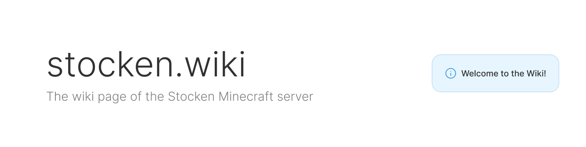

# stocken wiki
The wiki web application for stocken.
The purpose of the wiki is to provide a platform for players of the Stocken Minecraft server to be able to worldbuild, roleplay and document their time on the server.

## General Architecture & Design Choices
The frontend is written in React and uses Vite as its build tool. Use of functional React components and css-modules are preferred. 

The backend is a typical Node.js, Express.js web API. The database used is MongoDB. The backend uses mongoose to interface with the database.

Both frontend and backend use TypeScript.

Communication between the backend and frontend are accomplished via AJAX, more specifically via the fetch-API. Fetch-calls directly in components are not preferred, instead use the abstractions of the backend API available in src/network.

## Contributing
All contributions need an issue. If none exists for your specific fix/feature, create one. When there is an issue for your contribution, branch ```development``` with a suitable name. Once the fix/feature is ready, make sure that your branch is up-to-date with ```development``` and submit a pull request for review.

The project is continuously deployed. Changes / commits to the main branch will trigger a set of GitHub actions workflows that deploys both the backend and frontend.

## 


